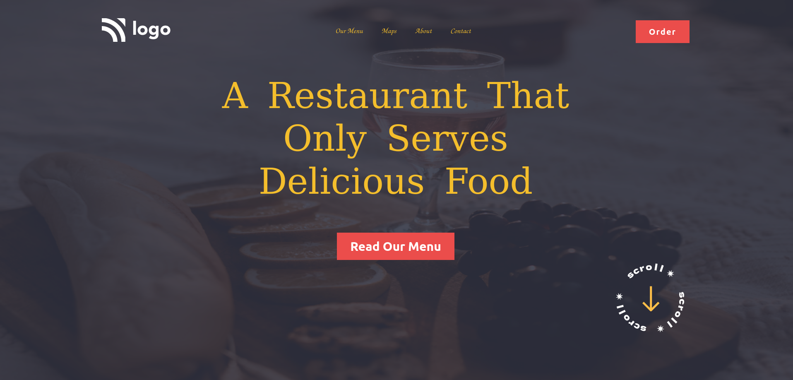

# PROJECT 2 - Delicious food in restaurant

This is the second mini-challenge among the 15 Ineuron-projects.

## Table of contents

- [Overview](#overview)
  - [Screenshot](#screenshot)
  - [Links](#links)
- [My process](#my-process)
  - [Built with](#built-with)
  - [Time required](#time-required)
  - [What I learned](#continues-development)
  - [Useful resources](#useful-resources)
- [Author](#author)
- [Acknowledgments](#acknowledgments)

## Overview

### Screenshot



### Links

- Code File URL: [github.com](https://github.com/Jyotimoykathar/Project-02)
- Live Site URL: [netlify.app](https://project-02-restaurant.netlify.app/)

## My process

### Built with

- Semantic HTML5 markup
- CSS custom properties
- Flexbox Css

### Time required

Nearly two day required to get the desired position of the image.

### What I learned

This is the css design code snippet of the navbar class of Restaurant project. I learned that with flexbox it was easy to beautifuly placed our navbar.

```css
.navbar {
  display: flex;
  flex-wrap: wrap;
  justify-content: space-between;
  align-items: center;
  cursor: pointer;
}
```

### Continued development

I still have a lot to learn about flexbox. I have been looking the recorded classes of Ineuron/LCO and also some articles from MDN and W3 school.The design page here is static and responsiveness is still pending.

### Useful resources

- [MDN](https://developer.mozilla.org/en-US/) - This website helped me to any thing i had to look upon.
- [MDN flex-direction](https://developer.mozilla.org/en-US/docs/Web/CSS/flex-direction) - This is an amazing article which helped me finally understand flex-direction. I'd recommend it to anyone still learning this concept.

## Author

- Github page- [Jyotimoykathar](https://github.com/Jyotimoykathar/)

## Acknowledgments

Special Thanks to Ineuron team for the mini-challenge to test and improve my CSS flexbox skills.
